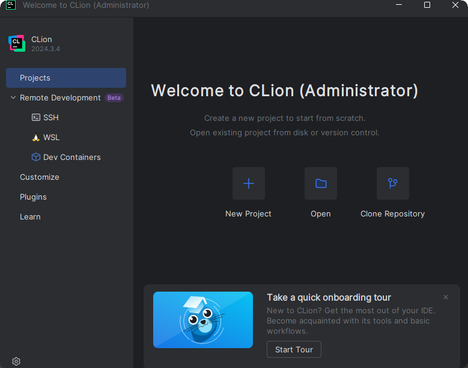
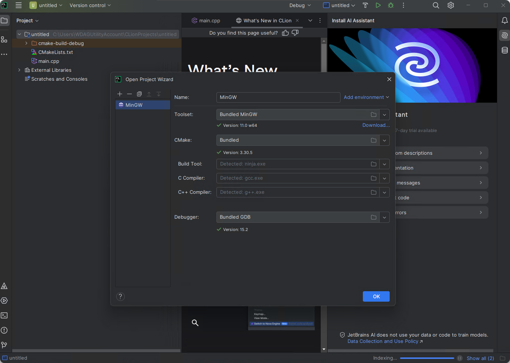
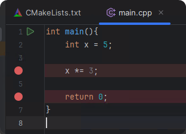
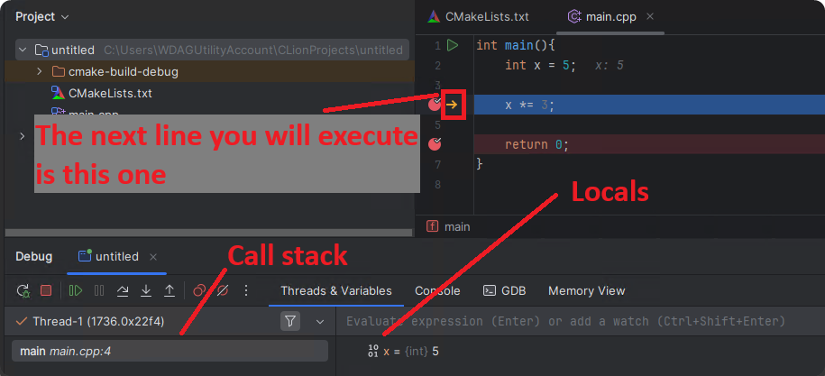
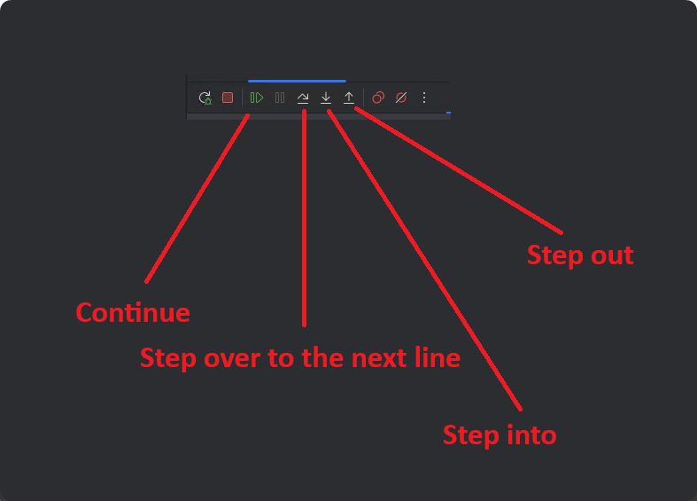

# CLion

CLion is a commercial IDE from JetBrains. Altough it is expensive for regular users, it is free for university students. <br>
You can check if you school is on the list in the swot repo: <https://github.com/JetBrains/swot>

## Applying for a license

You can apply for a student license at: <https://www.jetbrains.com/shop/eform/students> <br>
Use your university email address. After you complete the application form you will be prompted to create a JetBrains account. Your license will be tied to this account. You will recieve a confirmation email about your license application to your university email address.

## Downloading CLion

You can download CLion at: <https://www.jetbrains.com/clion/download>


During installation, tick the "Add bin folder to PATH" and "Add Open Folder as Project" options.

After completing the installation, you should be prompted to log into your JetBrains account.<br>
If this doesn't happen, you can log in from the menu later after creating a project: Help -> Register...

## Installing devtools

CLion ships with MinGW GCC on Windows. If you want to install MSVC, use the Visual Studio Installer to install it. You will be able to use MSVC from CLion.

## Creating a new project

After you installed and activated CLion with your JetBrains account, you should see this page:



Click "New Project". Select C++ Executable, name your project and select a C++ standard. C++23 is a good choice if you don't know what to use.

The next thing you will see is this:



If you have other toolchains like MSVC installed, they will appear here. If you don't just click "Ok".<br>
Try and see if your setup works by pressing the green play button or press Shift + F10.<br>
A terminal should pop up at the bottom that says "Hello, World!".

## Useful settings in CLion

* If you want to disable the one line JetBrains AI completions, create a file called `.noai` in the project's root directory.
* Disable smart identation: Settings > Editor > Code Style > Uncheck: "Detect and use existing file idents for editing"
* Configure your keybindings as you wish in the settings
* Configure your code style like identation, line breaks, naming, etc. : Settings > Editor > Code Style > C/C++

## Using the debugger in CLion

If you selected a correctly installed toolchain, CLions debugger works out of the box.<br>
Let's try using it! Here is a simple code snippet:
```cpp
int main(){
    int x = 5;

    x *= 3;

    return 0;
}
```

Let's place 2 breakpoints, one on the `x *= 3;` line, and one on the `return 0;` line. You can place breakpoints by clicking the line numbers. It should look something like this: <br>


Press the little green bug icon in the top right, or press CTRL + F9. Your program should start and immediately break on the first breakpoint. At the bottom of the window, the debug menu appeared with your local `x` variable. This is where you will be able to inspect variables when you use the debugger.<br>



The debug menu has 4 very important buttons:<br>


* Resume Program: When your program is paused, use this to continue execution
* Step over: Step to the next line. This will skip any function calls on the current line.
* Step into: Similar to "Step over", but it will step into functions on the current line.
* Step out: Immediately steps out of the current function by running all lines until the function returns.<br>
Useful when you are stuck in some function that you do not care about.

For now, press "Step over". As you can see, the value of `x` changed from `5` to `15`, due to the effects of the line we just ran.

You can press "Resume Program" now to execute the rest of the program (which is not much in this case).