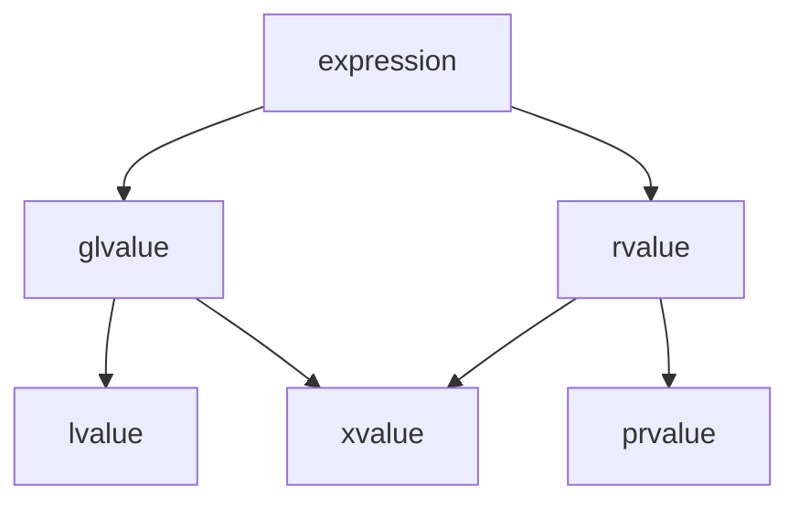

[[toc]]

## What value categories are for

By the end of this page, you should have a strong intuition for value categories, and they should feel a lot less mysterious.

Stated plainly value categories answer a practical question:

"When I write this expression, does it refer to an object with identity, or is it a pure value or an expiring view of an object?"

If that question looks scary, that is completely normal. The wording is more formal than the idea. In this page, we are going to turn it into a few simple ideas you can apply while reading and writing C++.

That question controls things you hit early in C++:

- Whether a reference can bind (`T&`, `T const&`, `T&&`)
- Which overload is chosen, which is common in move-aware APIs
- Whether an operation copies or moves
- What `std::move` actually does
- Why templates use `T&&` and `std::forward`

By the end of this page, you should be able to look at an expression and predict:

- Is it an lvalue or rvalue?
- Will this call copy or move?
- Which overload will be selected?

## Expressions have value categories

Value categories belong to **expressions**, not variables.

You might be thinking, "Wait, what is an expression?"

In C++, an **expression** is any piece of code that produces a value or refers to an object. It is the stuff you can put on the right-hand side of `=`, pass as a function argument, or combine with operators.

Here are a few common expressions:

- A single name like `name`
- A literal like `"Wheatley"` or `123`
- A calculation like `a + b`
- A member access like `name.size()`
- A function call like `make_string()`

Example:

```cpp
#include <string>

std::string make_string() {
    return "Wheatley";
}

int main() {
    std::string name = "Wheatley";

    // name is a variable of type std::string.
    // The expression "name" is an lvalue expression.

    auto a = name;            // uses the lvalue expression "name"
    auto b = name + "!";      // "name + \"!\"" is an expression too
    auto c = make_string();   // function call is an expression
    auto d = name.size();     // member call is an expression
}
```

The important point is that you can use the same variable in different expressions, and the value category can change depending on the expression you wrote.

Here is the same variable used in two different expressions:

```cpp
#include <string>
#include <utility>

int main() {
    std::string name = "Wheatley";

    name;            // expression is an lvalue
    std::move(name); // expression is an xvalue (treat it as expiring)
}
```

This mindset is the biggest improvement. Once you think in expressions, the rules stop contradicting each other.


## The foundation: lvalues and rvalues

Most real code can be explained with two buckets: **lvalues** and **rvalues**. If you get comfortable sorting expressions into these two, the rest of the topic stops feeling like magic.

A simple way to think about it is this:

- **lvalue** means "this expression refers to a particular object"
- **rvalue** means "this expression is a value, or it is being treated like a temporary"

### lvalue (refers to an object, has identity)

An **lvalue expression** refers to an object with identity. In practice, this usually means you can:

- refer to it again later and it is the same object
- take its address
- assign to it if it is not `const`

Common lvalues:

- named variables (`x`, `name`, `vec`)
- dereferenced pointers (`*p`)
- member access (`obj.field`)
- container elements like `v[i]` and `m[key]` when they return a reference

```cpp
#include <vector>
#include <map>
#include <string>

int main() {
    int x = 1;
    int* p = &x;

    x = 2;   // "x" is an lvalue expression
    *p = 3;  // "*p" is an lvalue expression, it refers to the object p points to

    std::vector<int> v {1, 2, 3};
    v[0] = 10; // "v[0]" is an lvalue expression because operator[] returns int&

    std::map<std::string, int> m {};
    m["hi"] = 5; // "m[...]" is an lvalue expression, it refers to the stored element
}
```

A simple test that works often is this:

If you can put the expression on the left side of `=` in a normal assignment, it is usually an lvalue expression.

### rvalue (pure value, or an object treated as expiring)

An **rvalue expression** is one of these:

* a pure value being computed
* an object being treated as temporary or expiring, so move-aware code is allowed to take from it

Common rvalues:

* literals (`123`, `true`)
* arithmetic results (`a + b`)
* temporaries (`T{}`, `std::string("hi")`)
* function calls returning by value

```cpp
#include <string>

std::string make_title() {
    return "Wheatley";
}

int main() {
    int a = 2;
    int b = 3;

    int sum = a + b;                    // "a + b" is an rvalue expression
    std::string t = make_title();       // function call is an rvalue expression
    std::string u = std::string("hi");  // temporary is an rvalue expression
}
```

A simple test that works often is this:

If it feels like a temporary result, it is usually an rvalue expression.

::: tip A rule you can lean on

If an expression is a **named variable**, it is an **lvalue expression**.

This stays true even when the variable’s type contains `&&`. You will see why that matters in the move section.

:::

::: note A small correction to the "address" intuition

Not every lvalue has an address you can take. Bit-fields are the classic exception. For most beginner-level code, "lvalues usually have an address" is still a useful mental model.

:::


## Reference binding rules (why things compile or not)

Reference binding is where value categories pay off immediately.

These are the rules worth memorizing:

* `T&` binds to **lvalues**
* `T&&` binds to **rvalues**
* `T const&` binds to **lvalues and rvalues**

```cpp
int main() {
    int x = 10;

    int& a = x;           // ok: lvalue -> T&
    int const& b = x;     // ok: lvalue -> T const&
    int const& c = 20;    // ok: rvalue -> T const&
    int&& d = 20;         // ok: rvalue -> T&&
}
```

And these are rejected for good reasons:

```cpp
int main() {
    int x = 10;

    int& a = 20;    // error: T& cannot bind to rvalue
    int&& b = x;    // error: T&& cannot bind to lvalue
}
```

If you can classify the argument expression as lvalue or rvalue, you can usually predict the compiler's decision.

::: info Why does `const&` bind to rvalues?

Because it is safe: you cannot modify a temporary through a `const&`.

In some cases, it also extends the temporary’s lifetime (covered later).

:::

## How this shows up in real APIs

Move-aware code often provides two overloads:

* one that accepts an existing object (`const&`)
* one that accepts a temporary or expiring object (`&&`)

Example: storing a window title.

```cpp
#include <string>
#include <utility>

class window {
public:
    void set_title(std::string const& t) {
        title_ = t;
    }

    void set_title(std::string&& t) {
        title_ = std::move(t);
    }

    std::string const& title() const {
        return title_;
    }

private:
    std::string title_;
};

int main() {
    window w;

    std::string user_title = "Wheatley";

    w.set_title(user_title);            // lvalue -> const& overload (copy)
    w.set_title("Settings");            // literal -> temporary std::string -> && (move)
    w.set_title(std::string("UI"));     // temporary std::string -> && (move)
    w.set_title(std::move(user_title)); // expiring -> && (move)
}
```

A good intuition here:

* lvalues usually mean: "existing object, don't steal from it"
* rvalues usually mean: "pure value or expiring object, it's OK to steal resources"

That intuition is the backbone of move semantics.

## What `std::move` really does

`std::move` does not move anything by itself.

It is a cast that changes the *value category of the expression* so that move-aware code is allowed to run.

```cpp
#include <string>
#include <utility>
#include <vector>

int main() {
    std::vector<std::string> names;

    std::string name = "Wheatley";

    names.push_back(name);             // lvalue -> copy
    names.push_back(std::move(name));  // rvalue -> move
}
```

Why is the second call allowed to move?

Because `std::move(name)` produces an rvalue expression, which signals "this object may be treated as expiring".

::: note Moving a const object often copies

`std::move` on a `const` object produces `const T&&`. Most move operations require `T&&` (non-const), so this commonly falls back to copying.

```cpp
#include <string>
#include <utility>

int main() {
    std::string const a = "hi";
    std::string b = std::move(a);
}
```

:::

::: warning Moved-from objects

After `std::move(name)`, `name` is still valid, but you should not rely on its previous contents.

Only move from an object when you are done using its old value.

:::

### Moving from members and subobjects

You can also move from a member, which is common when a type is being "consumed" into a new object.

```cpp
#include <string>
#include <utility>

struct message {
    std::string text;
};

message consume(message m) {
    message out;

    // m is a local copy. We can safely take its resources.
    out.text = std::move(m.text);

    return out;
}

int main() {
    message m;
    m.text = "Wheatley";

    message n = consume(std::move(m));
}
```

::: tip Member access depends on the base expression

`obj.field` is an lvalue when `obj` is an lvalue.

If the base is an xvalue, the member expression is an xvalue too, which is why moving from members often looks like `std::move(obj).field`.

```cpp
#include <string>
#include <utility>

struct S { std::string m; };

int main() {
    S s;
    auto& a = s.m;
    auto&& b = std::move(s).m;
}
```

:::

## The trap everyone hits: a named `T&&` is still an lvalue expression

This is where value categories being about *expressions* matters.

```cpp
#include <string>
#include <utility>

int main() {
    std::string&& tmp = std::string("Wheatley");

    // tmp is an rvalue reference, but `tmp` is a named variable expression.
    // Named variable expressions are lvalues, so tmp behaves like an lvalue here.
    tmp += " (online)";

    // std::move(tmp) turns the expression into an xvalue (treat tmp as expiring),
    // which allows move-aware code to move from it.
    std::string moved = std::move(tmp);
}

```

The same thing happens with function parameters:

```cpp
#include <string>
#include <utility>

void store_title(std::string&& t) {
    // Even though t has type std::string&&, it is a named variable in this scope.
    // Named variables are lvalue expressions, so using `t` directly would copy.
    // Use std::move(t) to treat it as expiring and allow a move.
    std::string local = std::move(t);
}

```

If you accidentally write `std::string local = t;`, you copy.

This is not the compiler being picky. It is a safety feature: the compiler does not assume you want to consume a named object unless you say so.

## When rvalue is too broad

At this point, you should be able to successfully reason about a lot of code.

The next layer exists because rvalues come in two different shapes in practice:

1. Pure values, like `a + b` or `std::string("UI")`
2. Existing objects treated as expiring, like `std::move(name)`

C++ gives these names:

* **prvalue** (pure rvalue): a pure value
* **xvalue** (expiring value): an expiring object

If you already have the lvalue vs rvalue intuition, these names just refine the rvalue bucket.

## prvalues (pure rvalues)

A prvalue is a pure rvalue.

Typical examples:

```cpp
#include <string>

std::string make_label() {
    return std::string("Wheatley"); // returns by value
}

int main() {
    int a = 2;
    int b = 3;

    int sum = a + b;                     // prvalue: result of an expression
    std::string label = make_label();    // prvalue: call result (returned by value)
    std::string tmp = std::string("UI"); // prvalue: temporary value
}

```

The key idea: a prvalue is not an expression that keeps referring to the same object. It is a value used to initialize something else.

::: note Advanced: prvalue materialization

In modern C++, many prvalues do not create a distinct temporary object unless an object is needed (for example, to bind a reference). This is part of why return-by-value is usually fast.

You can write good code without knowing the details. The practical rule stands: prvalues behave like pure values.

:::

## xvalues (expiring objects)

An xvalue is an expression that refers to an object, but one you are treating as expiring.

The most common way to produce an xvalue is `std::move`.

```cpp
#include <string>
#include <utility>
#include <vector>

int main() {
    std::vector<std::string> v;

    std::string name = "Wheatley";

    v.push_back(name);             // lvalue -> copy
    v.push_back(std::move(name));  // xvalue -> move
}
```

That is why xvalues matter: they are the category that unlocks move semantics for objects that already exist.

## Bringing it together: the full vocabulary

Once you know lvalue, prvalue, and xvalue, the rest are just set names:

* **glvalue**: lvalue or xvalue (an expression that refers to an object)
* **rvalue**: prvalue or xvalue

Set relationships:

$$
\text{glvalue} = \text{lvalue} \cup \text{xvalue}
$$

$$
\text{rvalue} = \text{prvalue} \cup \text{xvalue}
$$

The relationship diagram:



A practical summary table:

| Category | What it feels like                      | Typical examples                          |
| -------- | --------------------------------------- | ----------------------------------------- |
| lvalue   | refers to an existing object (identity) | `name`, `*p`, `obj.field`                 |
| prvalue  | pure value used to initialize something | `a + b`, `T{}`, `std::string("x")`        |
| xvalue   | refers to an object treated as expiring | `std::move(name)`, `std::move(obj).field` |
| glvalue  | refers to an object                     | lvalue or xvalue                          |
| rvalue   | prvalue or xvalue                       | pure value or expiring object             |

If you only keep one new word from this section, keep **xvalue**: it is the move-from-candidate category.

## A fast way to classify expressions

When you are reading code, ask these questions in order:

1. Is it a named variable expression?
   It is an **lvalue**.

2. Is it a literal, `a + b`, or `T{}`?
   It is an **rvalue**, usually a **prvalue**.

3. Is it `std::move(x)`?
   It is an **rvalue**, specifically an **xvalue**.

That is enough to predict reference binding and most overload choices.

::: tip Try this on function returns

If a function returns by value (`T`), `f()` is a prvalue at the call site.

If a function returns by reference (`T&`), `f()` is an lvalue at the call site.

If a function returns `T&&`, `f()` is an xvalue at the call site.

:::

## Lifetime and temporaries (common bugs)

Many lifetime bugs come from treating temporaries like they live longer than they do.

### Lifetime extension with `const&`

Binding a temporary directly to a `const&` can extend its lifetime:

```cpp
#include <string>

int main() {
    std::string const& r = std::string("Wheatley");
    // r keeps the temporary alive until r goes out of scope.
}
```

This is safe, but it is not a general storage pattern. If you need a normal local string, own it:

```cpp
#include <string>

int main() {
    std::string s = std::string("Wheatley");
}
```

::: note Lifetime extension is not a “pass it through a function” trick

Lifetime extension happens when a temporary is bound directly to the reference being initialized.

Binding a temporary to a reference parameter does not make it live longer than the full expression.

```cpp
#include <string>

std::string const& id(std::string const& s) { return s; }

int main() {
    auto const& r = id(std::string("Wheatley"));
}
```

:::

### Returning a reference to a temporary is wrong

```cpp
#include <string>

std::string const& bad_ref() {
    return std::string("Wheatley");
}
```

Return by value instead:

```cpp
#include <string>

std::string good_value() {
    return std::string("Wheatley");
}
```

::: details Rule of thumb for returning references

Returning `T const&` is correct when you return something that already lives long enough: a member, a global, or an element stored in a container with stable lifetime.

If the value is created inside the function, return by value.

:::

## API design: overload pair vs take-by-value

The `const&` + `&&` overload pair is common, but it is not always the best choice.

If an API stores a string, taking by value is often the cleanest option:

```cpp
#include <string>
#include <utility>

class window {
public:
    void set_title(std::string t) {
        title_ = std::move(t);
    }

private:
    std::string title_;
};
```

This keeps the call site simple and still gets good performance.

::: note Advanced: when two overloads are still useful

Two overloads can be useful when:

* you want different behavior for lvalues vs rvalues (not just performance)
* copying is expensive and you want to avoid the extra move from the by-value parameter
* you have multiple parameters and want fine-grained control

For many "store it" setters, take-by-value is a strong default.

:::

## Templates: preserving value categories with forwarding

Sooner or later you will see this pattern:

```cpp
template <class T>
void wrapper(T&& x);
```

In templates, `T&&` can be a **forwarding reference** when `T` is deduced.

The goal is simple: accept either an lvalue or an rvalue, and then pass it along while preserving what the caller provided.

A realistic example is forwarding into `emplace_back`:

```cpp
#include <string>
#include <utility>
#include <vector>

struct job {
    int id;
    std::string name;

    job(int i, std::string n)
        : id(i), name(std::move(n)) {}
};

template <class... Args>
job& add_job(std::vector<job>& jobs, Args&&... args) {
    return jobs.emplace_back(std::forward<Args>(args)...);
}

int main() {
    std::vector<job> jobs;

    std::string n = "Wheatley";
    add_job(jobs, 1, n);
    add_job(jobs, 2, std::string("UI"));
}
```

If you replaced `std::forward` with `std::move`, the first call would move from `n`, which is almost never what you want.

::: details Reference collapsing (the mechanic behind forwarding)

When references combine, C++ collapses them:

* `U& &&` becomes `U&`
* `U&& &` becomes `U&`
* `U&& &&` becomes `U&&`

That is why a forwarding reference can represent either kind of reference.

:::

## Advanced tool: `decltype((expr))` for exact answers

If you are debugging templates and want a mechanical check, `decltype((expr))` tells you the expression category:

* `decltype((expr))` is `T&` if `expr` is an lvalue expression
* `decltype((expr))` is `T&&` if `expr` is an xvalue expression
* `decltype((expr))` is `T` if `expr` is a prvalue expression

Example:

```cpp
#include <type_traits>
#include <utility>

int main() {
    int x = 0;

    static_assert(std::is_same_v<decltype((x)), int&>);
    static_assert(std::is_same_v<decltype((std::move(x))), int&&>);
    static_assert(std::is_same_v<decltype((0)), int>);
}
```

This is not something you use in normal application code, but it explains why you sometimes see double parentheses around `expr` in template metaprogramming.

## Cheat sheet

Reference binding:

* `T&` -> lvalues
* `T const&` -> lvalues and rvalues
* `T&&` -> rvalues

Expression classification:

* named variable expression -> lvalue
* literal / `a + b` / `T{}` -> rvalue (usually prvalue)
* `std::move(x)` -> rvalue (xvalue)

